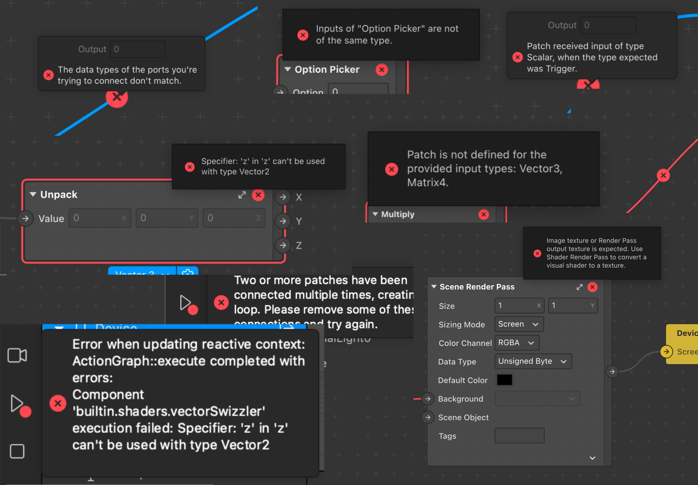

# Playground

Welcome to the playground section of the workshop.

This consists of a small Spark AR project you can download to try out different concepts you'll learn. I do encourage you to go ahead and give it a try

## Keep in mind
When you run code you're giving Spark a list of instructions to execute, if the list is faulty, it will complain (also known as "throwing an error")

It's nothing to be afraid of. All developers get dozens of errors during the course of writing a script.

Just like in the patch editor, errors don't mean you're bad at what you're doing, just that there's a small mistake that needs to be fixed

## How to use it

### Setting up a development environment

You're probably wondering how and where to write code... Can you do it on a phone? Can you do it on Google Docs? The answer is that you can write code almost anywhere/on any device, however...

- For the purposes of writing code for this workshop, you'll need to do so on a computer that runs Spark AR Studio.

- As for which program to write with, it is recommended that you use Visual Studio Code, as it's the code editor we'll be using to teach this workshop, and is the one preferred by Spark AR Studio.

    > [Download Visual Studio Code (VSC) here](https://code.visualstudio.com/download)

    > [(Video) Getting Started with Visual Studio Code (EDU)](https://youtu.be/ITxcbrfEcIY)

### Opening the project

To use the playground
1. [Download it](https://raw.githubusercontent.com/tomaspietravallo/sparkar-scripting-workshop/master/playground/playground.arprojpkg)
2. Open the project in Spark AR Studio
3. Head to the asset panel, and open the Script
4. Start to modify it!
5. Save it (Ctrl + S for short)
6. Go to Spark AR Studio, and wait for the changes to load

---

If it's the first time you ever open a script, you may need to configure your computer so that it opens .js or .ts files with VSC automatically

#### First time frequent issues:

Error: EACCES: permission denied

Shutting down Spark AR Studio and then opening it again usually solves it.

Additionally, you can try launching Spark AR by using Ctrl + Click from the launch pad. [Apple Support page](https://support.apple.com/guide/mac-help/open-a-mac-app-from-an-unidentified-developer-mh40616/mac)

Error: EACCES: permission denied, copyfile '/Users/user/Library/Caches/Facebook

[Here's a community post that worked through it](https://www.facebook.com/groups/SparkARcommunity/posts/763866907358687)

